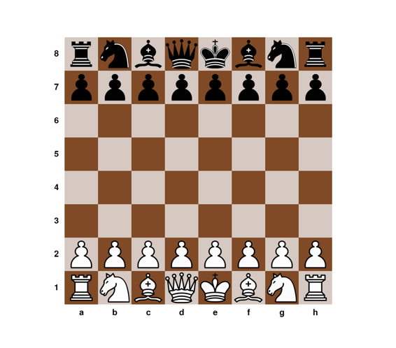
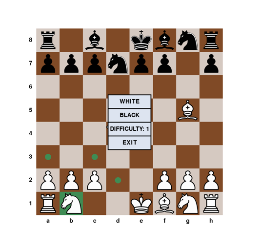

[](https://github.com/agresh775/Chess/actions/workflows/ci.yml)

# Шахматное приложение
Приложение состоит из двух частей - графического интерфейса (GUI) и шахматного движка. Графический интерфейс реализован на языке Python с помощью библиотеки Pygame.
Движок реализован на языке C++. Общение GUI и движка реализовано посредством универсального шахматного протокола (UCI).

## Использование

### 1. Клонирование репозитория

```bash
git clone https://github.com/agresh775/Chess.git
cd Chess
```

### 2. Установка зависимостей

#### Linux

```bash
sudo apt update && sudo apt install -y \
    python3-pip python3-venv \
    cmake ninja-build g++ \
    clang-format clang-tidy

python3 -m venv .venv && source .venv/bin/activate
pip install pygame ruff
```

#### Windows

```powershell
winget install Python.Python.3.13 Kitware.CMake Ninja-build.Ninja Chocolatey.Chocolatey
choco install mingw -y

py -m pip install pygame ruff
pip install clang-tools
clang-tools --install 23 --tool clang-format clang-tidy
```

### 3. Сборка

#### Linux

```bash
cd engine/src
python3 build.py
```

#### Windows

```powershell
cd engine\src
python build.py
```

### 4. Запуск

#### Linux

```bash
cd gui/src
python3 main.py
```

#### Windows

```powershell
cd gui\src
python main.py
```

### 5. Результат





## Документация

### UCI

gui-запрос:

1. uci - открыть сессию
2. ucinewgame - начало новой игры
3. isready - проверка готовности
4. position startpos moves `<move1>` `<move2>` ... - позиция игры в последовательных ходах с начала партии
5. go depth `<N>` - сделать ход с максимальной глубиной N
6. quit - закрыть сессию

engine-ответ:

1. id name ChessEngine - название
2. id author agresh775 - автор
3. uciok - сессия открыта
4. readyok - готов
5. bestmove `<move>` - лучший ход

### Правила

Все стандартные ходы шахматных фигур, рокировка, взятие на проходе.
Пешка может превратиться только в ферзя.
Мат, шах, пат возможны.
Ничья наступает при пате, 50 полуходах без взятий и ходов пешками, недостаточно материала (K vs K, K + B vs K, K + N vs K).

### Исходники

#### main.py

Точка входа. Настраивает игровое окно, запускает движок.

#### board.py

Структура для отрисовки игрового поля, хранения игровой позиции и реализации правил игры.

#### setting.py

Структура для хранения кнопок настроек игры: цвет, сложность, выход из игры.

#### converter.py

Вспомогательный файл, хранящий функции перевода числовых позиций класса Board в стандартные шахматные обозначения и наоборот.

#### main.cpp

Код движка. Содержит реализацию UCI, структуру Position, вложенную в неё структуру Piece, функции оценки позиции, поиска возможных и лучших ходов.

